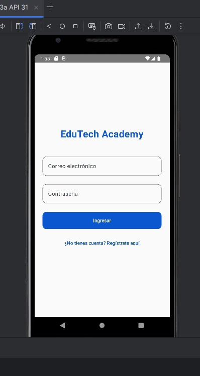
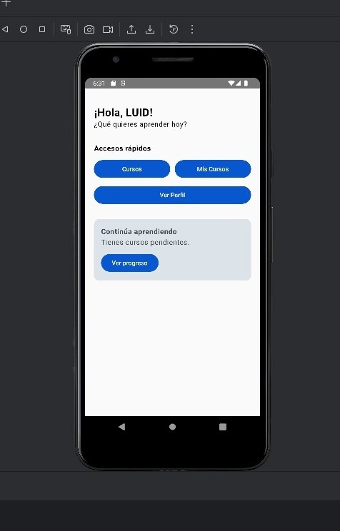
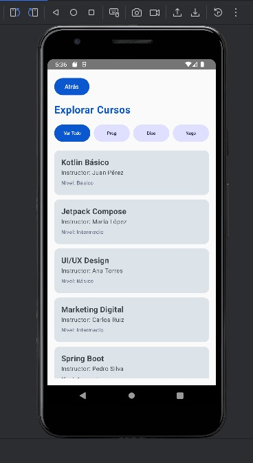
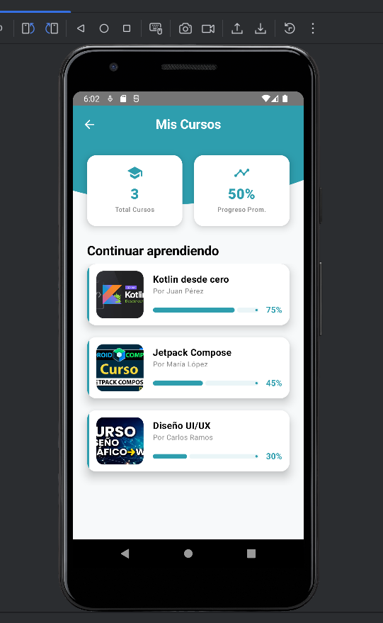
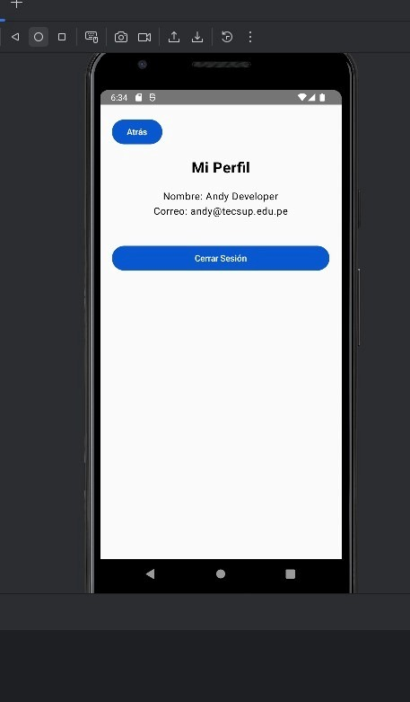
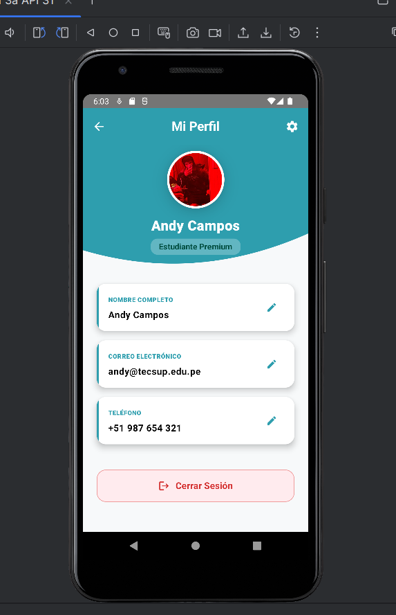

# MEJORAS_GEMINI.md — EduTech Academy

## Sobre este documento
Durante la segunda etapa del proyecto usamos Gemini directamente en Android Studio para auditar y mejorar el diseño de nuestras pantallas. Cada mejora incluye capturas del antes y después, el prompt que usamos y una reflexión de lo que aprendimos.

## Herramienta utilizada
**Gemini en Android Studio** — asistente de IA integrado que nos permitió rediseñar pantallas completas en Jetpack Compose manteniendo la lógica de navegación existente.

---
---

## Mejora 1 — LoginScreen y RegisterScreen

### Antes

### Después

### Prompt utilizado
"hola soy Andy, estoy desarrollando una app de cursos para mi examen y mi LoginScreen se ve muy simple, quiero que la parte de arriba tenga un fondo celeste con efecto de onda y los campos de correo y contraseña con íconos, el botón celeste redondeado y un texto para ir al registro, el RegisterScreen que tenga el mismo diseño pero con más campos y validación de contraseñas, no toques la navegación con NavController que ya tengo"

### Reflexión
Gemini transformó dos pantallas muy básicas en interfaces con identidad visual propia. Lo más útil fue que mantuvo toda la lógica de navegación intacta mientras rediseñaba completamente la UI.

---

## Mejora 2 — HomeScreen

### Antes

### Después

### Prompt utilizado
"che Gemini necesito ayuda, mi HomeScreen tiene solo botones planos y se ve horrible, quiero que tenga el mismo estilo celeste con onda que mi login, con cards para los accesos rápidos con íconos, una sección de cursos populares con las imágenes reales de cada curso usando el imageRes del modelo y una barra de navegación abajo, por favor no rompas la navegación con NavController"

### Reflexión
La mejora más notoria fue pasar de botones planos a una interfaz estructurada con secciones claras. Gemini supo mantener la consistencia visual con el login usando el mismo estilo de onda celeste.

---

## Mejora 3 — CoursesScreen

### Antes

### Después

### Prompt utilizado
"oye Gemini mi pantalla de cursos se ve muy fea, los chips tienen emojis que se ven raros y los cursos son solo texto sin imagen, quiero que tenga el mismo header celeste con onda, los chips sin emojis con el seleccionado en celeste, y cada curso en una card con su imagen real usando course.imageRes, título instructor y nivel, cuida la navegación con NavController"

### Reflexión
Eliminar los emojis y agregar imágenes reales hizo que la pantalla pasara de verse como un prototipo a una app real. Gemini aplicó los cambios respetando la estructura de datos existente.

---

## Mejora 4 — MyCoursesScreen

### Antes

### Después

### Prompt utilizado
"Gemini ayúdame con esta pantalla, mis cursos inscritos se ven muy vacíos solo con texto y una barra simple, quiero que tenga el header celeste con onda igual que las otras pantallas, dos cards arriba con estadísticas de total de cursos y progreso promedio, y cada curso con su imagen real a la izquierda y la barra de progreso celeste con el porcentaje, no pierdas la navegación"

### Reflexión
Agregar las estadísticas arriba le dio más contexto al usuario sobre su progreso general. Gemini implementó correctamente las cards de resumen sin romper la lógica de progreso existente.

---

## Mejora 5 — CourseDetailScreen

### Antes

### Después

### Prompt utilizado
"necesito mejorar mi pantalla de detalle de curso porque se ve muy simple y aburrida, quiero que tenga el header celeste con onda, la imagen real del curso sin ningún ícono de play encima usando course.imageRes, badge de categoría, duración y nivel con íconos, descripción, card del instructor y el botón inscribirse fijo abajo en celeste, mantén la navegación con NavController"

### Reflexión
La pantalla de detalle fue la que más cambió visualmente. Gemini logró mostrar la imagen real del curso correctamente usando el modelo de datos existente sin necesitar cambios en la estructura.

---

## Mejora 6 — ProfileScreen

### Antes

### Después

### Prompt utilizado
"mi perfil está muy vacío solo muestra nombre y correo en texto plano, quiero mejorarlo para que tenga el mismo header celeste con onda, mi foto de perfil en un avatar circular con borde blanco, y tres campos editables de nombre correo y teléfono donde pueda tocar el lápiz para editar, un botón guardar que aparezca solo cuando edité algo y el botón cerrar sesión en rojo que regrese al login, no pierdas la navegación"

### Reflexión
La funcionalidad de edición de campos fue lo más valioso de esta mejora. Gemini implementó el estado de edición correctamente con mutableStateOf para cada campo sin romper la navegación existente.