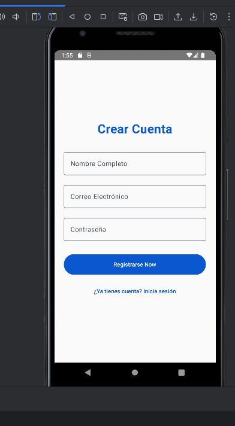
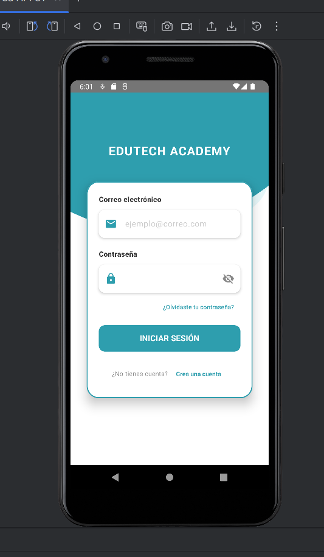
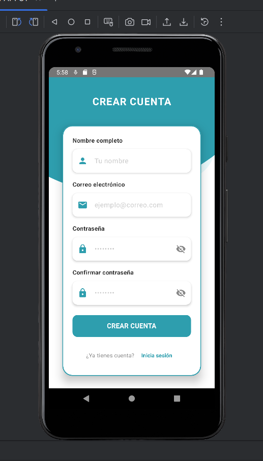
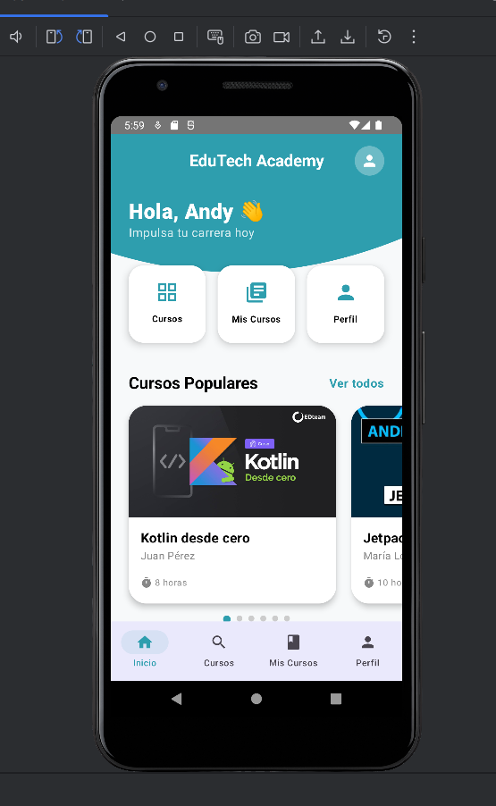
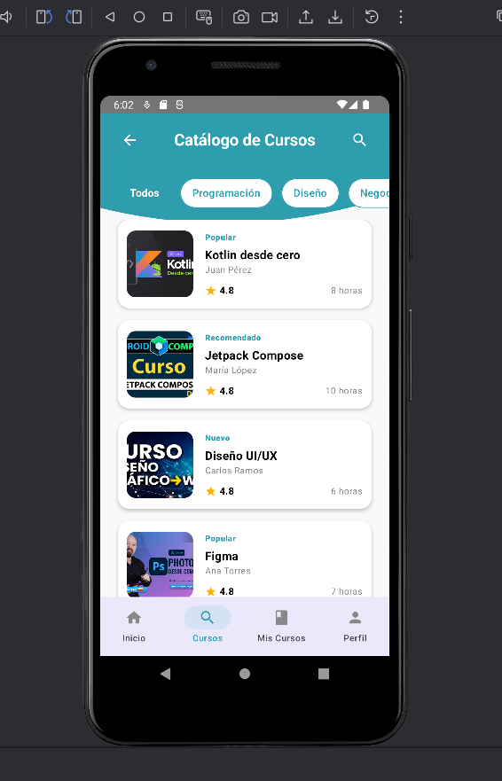
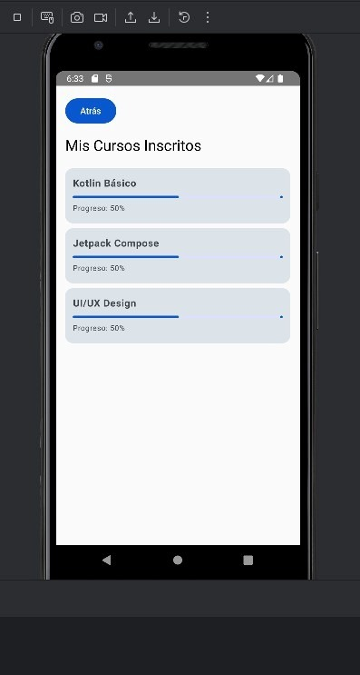
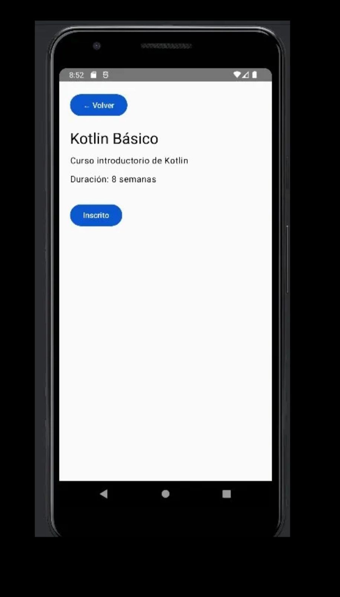
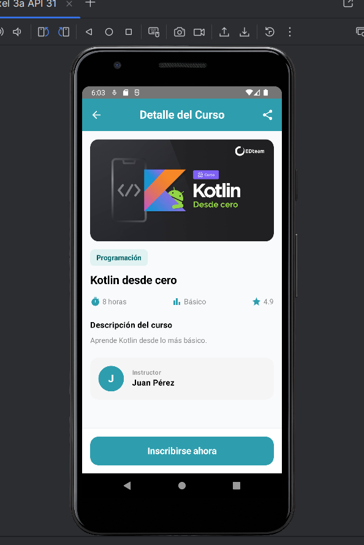

# MEJORAS_GEMINI.md — EduTech Academy

## Herramienta utilizada
Gemini en Android Studio

---

## Mejora 1 — LoginScreen y RegisterScreen

### Antes

### Después

### Prompt utilizado
"soy estudiante y estoy haciendo una app de cursos llamada EduTech Academy, quiero mejorar mi LoginScreen y RegisterScreen en Jetpack Compose, que se vea bonito con un fondo celeste arriba con efecto de onda, los campos de correo y contraseña con íconos, botón celeste redondeado, y que el registro tenga los mismos colores pero con más campos y validación, no pierdas la navegación con NavController que ya tengo"
### Reflexión
Gemini permitió transformar pantallas básicas en interfaces modernas con identidad visual propia, ahorrando tiempo en efectos visuales complejos como el efecto onda.

---

## Mejora 2 — HomeScreen

### Antes

### Después

### Prompt utilizado
"soy estudiante y estoy haciendo una app de cursos llamada EduTech Academy, quiero mejorar mi HomeScreen en Jetpack Compose, que tenga el mismo estilo celeste de mis otras pantallas arriba con efecto de onda, el nombre del usuario en blanco, accesos rápidos con cards e íconos, una sección de cursos populares con las imágenes reales de los cursos y una barra de navegación inferior, no pierdas la navegación con NavController que ya tengo"
### Reflexión
La IA ayudó a mantener consistencia visual entre pantallas e implementar componentes complejos como la barra de navegación inferior y cards con imágenes reales.

---

## Mejora 3 — CoursesScreen

### Antes

### Después

### Prompt utilizado
"soy estudiante y estoy haciendo una app de cursos llamada EduTech Academy, quiero mejorar mi CoursesScreen en Jetpack Compose, que tenga el mismo estilo celeste arriba con efecto de onda, filtros de categoría como chips sin emojis, y cada curso en una card con su imagen real, el nombre del instructor y el nivel, no pierdas la navegación con NavController que ya tengo"
### Reflexión
Gemini ayudó a mejorar la experiencia de exploración de cursos agregando filtros visuales y mostrando imágenes reales en cada card de manera eficiente.

## Mejora 4 — MyCoursesScreen

### Antes

### Después

### Prompt utilizado
"soy estudiante y estoy haciendo una app de cursos llamada EduTech Academy, quiero mejorar mi MyCoursesScreen en Jetpack Compose, que tenga el mismo estilo celeste arriba con efecto de onda, cada curso con su imagen a la izquierda y una barra de progreso celeste, y arriba unas estadísticas que muestren cuántos cursos tengo y el progreso promedio, no pierdas la navegación con NavController que ya tengo"

## Mejora 5 — CourseDetailScreen

### Antes

### Después

### Prompt utilizado
"soy estudiante y estoy haciendo una app de cursos llamada EduTech Academy, quiero mejorar mi CourseDetailScreen en Jetpack Compose, que tenga el mismo estilo celeste arriba con efecto de onda, que muestre la imagen real del curso sin ningún ícono de play encima, la descripción duración y nivel del curso, los datos del instructor y un botón de inscribirse fijo abajo, no pierdas la navegación con NavController que ya tengo"
### Reflexión
Gemini permitió crear una pantalla de detalle profesional con imagen real del curso y botón de acción fijo en la parte inferior mejorando la experiencia del usuario.

## Mejora 6 — ProfileScreen

### Antes

### Después

### Prompt utilizado
"soy estudiante y estoy haciendo una app de cursos llamada EduTech Academy, quiero mejorar mi ProfileScreen en Jetpack Compose, que tenga el mismo estilo celeste arriba con efecto de onda, un avatar circular con la foto del usuario, y abajo tres campos editables de nombre correo y teléfono donde pueda modificar mis datos, un botón guardar cambios y un botón cerrar sesión en rojo, no pierdas la navegación con NavController que ya tengo"
### Reflexión
Gemini facilitó la implementación de campos editables con estado en Jetpack Compose, funcionalidad que hubiera tomado más tiempo desarrollar manualmente.